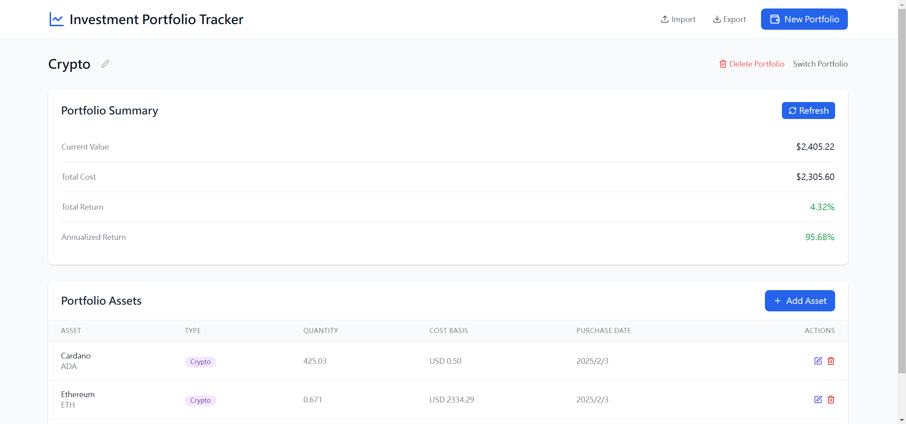

# Investment Portfolio Tracker


A modern, user-friendly web application for tracking investment portfolios and monitoring their performance in real-time.

## Features

- **Multiple Portfolio Management**
  - Create and manage multiple investment portfolios (US Stocks and Cryptocurrency)
  - Rename and delete portfolios
  - Import/Export portfolios for data backup and transfer

- **Asset Management**
  - Add, edit, and remove assets in each portfolio
  - Support for stocks and other securities
  - Real-time price updates from Finnhub API ([Get Free API Key](https://finnhub.io/))
  - Track purchase date, quantity, and cost basis

- **Portfolio Analytics**
  - Real-time portfolio valuation
  - Total return calculation
  - Annualized return metrics
  - Current value vs. total cost comparison

- **Data Persistence**
  - Automatic saving of portfolio data
  - Local storage for offline access
  - Import/Export functionality for data backup

## Getting Started

### Prerequisites

- Node.js 18 or higher
- npm or yarn package manager

### Installation

**1. Clone the repository:**
```bash
git clone https://github.com/e96031413/Investment-Portfolio-Tracker
cd investment-portfolio-tracker
```

**2. Install dependencies:**
```bash
npm install
```

**3. Set up environment variables:**
```bash
# Create a .env file in the root directory
cp .env.example .env

# Edit the .env file and add your Finnhub API key
# You can get a free API key from https://finnhub.io/
```

**4. Start the development server:**
```bash
npm run dev
```

**5. Visit the Investment Portfolio Tracker**
```
http://localhost:5173/
```
on Windows System, click ```start.bat```

## Usage Guide

### Creating a Portfolio

1. Click the "New Portfolio" button in the top right corner
2. Enter a name for your portfolio
3. Click "Create Portfolio"

### Adding Assets

1. Select a portfolio from the list
2. Click "Add Asset" in the portfolio view
3. Enter the asset details:
   - Symbol (e.g., AAPL, GOOGL)
   - Name
   - Quantity
   - Cost basis (purchase price)
   - Purchase date
   - Currency

### Managing Assets

- **Edit**: Click the edit icon next to an asset to modify its details
- **Delete**: Click the delete icon to remove an asset from the portfolio
- **View Performance**: The portfolio summary shows current value and returns

### Portfolio Import/Export

- **Export**:
  1. Click the "Export" button in the header
  2. Save the JSON file to your computer

- **Import**:
  1. Click the "Import" button in the header
  2. Select a previously exported JSON file
  3. Confirm the import

## Technical Details

### Built With

- React 18
- TypeScript
- Vite
- TanStack Query (React Query)
- Zustand for state management
- Tailwind CSS for styling
- Finnhub API for real-time market data
- Chart.js for data visualization

### Project Structure

```
src/
├── components/          # React components
├── services/           # API and external service integrations
├── store/              # State management
├── types/              # TypeScript type definitions
└── main.tsx           # Application entry point
```

### Key Components

- `Portfolio`: Main portfolio management interface
- `AssetList`: Asset listing and management
- `PortfolioMetrics`: Portfolio performance metrics
- `PortfolioImportExport`: Data import/export functionality

## Data Refresh

- Asset prices update automatically every minute
- Manual refresh available through the UI:
  - Use the "Refresh" button in the Portfolio to update price data
- Real-time US-market data provided by Finnhub API and Crypto data provided by Coinbase API

## Environment Variables

The application uses environment variables to securely store API keys. To set up your environment:

1. Create a `.env` file in the root directory (you can copy from `.env.example`)
2. Add your Finnhub API key:
   ```
   VITE_FINNHUB_API_KEY=your_api_key_here
   ```
3. Never commit your `.env` file to version control (it's already in `.gitignore`)

For deployment:
- When deploying to a hosting service, set the environment variables in your hosting platform's settings
- Refer to your hosting provider's documentation for instructions on setting environment variables

## Browser Support

The application is compatible with modern browsers:
- Chrome (latest)
- Firefox (latest)
- Safari (latest)
- Edge (latest)

## License

This project is licensed under the MIT License - see the LICENSE file for details.

## Acknowledgments

- Finnhub.io for providing market data API
- Lucide React for icons
- TanStack Query for data fetching
- Zustand for state management